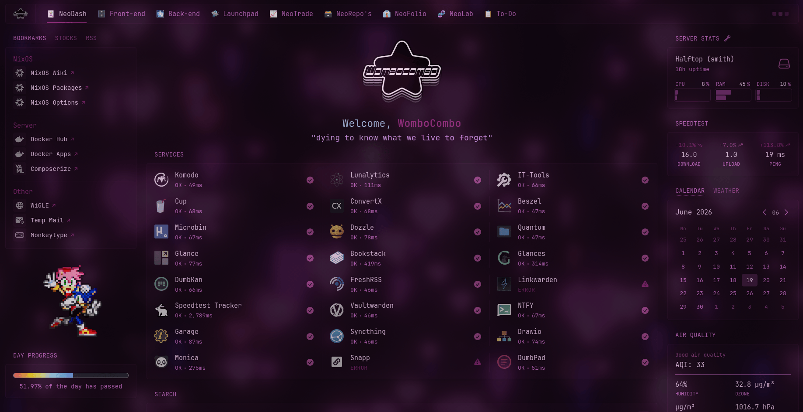
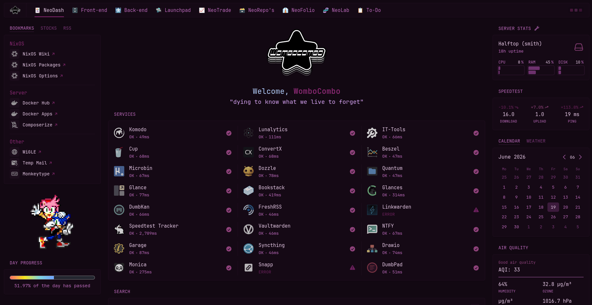

<!--
 here is a basic multiline comment for formatting reference o7
-->

<!--
<p align="center">
  
</p>


-->

<h1 align="center">Pywal Glance Theme</h1>

<p align="center">
  Pywal theme for Glance. (the self-hosted server dashboard)<br>
  All code is licensed under the <a href="LICENSE">Unlicense License</a>. (do whatever u want idc)
</p>

> Preview w/ blur


> Preview w/o blur



## Repository Structure
```
pywal-glance-theme/
├── md-assets/ ----------------------------- Images and other markdown/README assets
|  ├── pywal-glance-preview.gif ------------ Preview w/ blur
|  └── pywal-glance-preview-opaque.gif ----- Preview w/o blur
├── install.sh ----------------------------- Install script for pywal-to-glance.sh
├── LICENSE -------------------------------- License for the repo
└── README.md ------------------------------ Main README for the repo
```

## Installation
> [!NOTE]
> The actual script used here is held within my [bash scripts repository](https://github.com/0lswitcher/bash-scripts), and you can
> find it under `pywal-to-glance.sh`. \
> Feel free to take a look at it there to see the actual source code instead of the lil `install.sh` I have here. 

There are two methods for installing this script;
> - cURL and run the install script (which automatates the following option)
> 
*OR:*

> - cURL the source script from my [bash scripts repository](https://github.com/0lswitcher/bash-scripts), and make it executable

Either method is viable, and the choice is a matter of preference.

Lets begin with the first method:

### Method 1: (Easy, but unseen work)
```
curl -fsSL https://raw.githubusercontent.com/0lswitcher/pywal-glance-theme/refs/heads/main/install.sh | bash
```

### Method 2: (More involved)
Download the script:
```
curl -sLO https://raw.githubusercontent.com/0lswitcher/bash-scripts/refs/heads/main/scripts/pywal-glance-theme.sh
```
Then, make it executable:
```
chmod +x ./pywal-glance-theme.sh
```
That's it! \
Now, you can move it to another directory of your choosing:
```
mv ./pywal-glance-theme.sh /usr/local/bin/
```
> Feel free to replace `/usr/local/bin/` with whatever you prefer.

## Usage
Usage is simple, and I've written the script to be compatable with as many distro's and WM's possible. \
The only configuration required before running the script is to update the `$GLANCE_CONFIG` variable with your
correct `glance.yml` path *(likely pointing to a docker container, or `/opt/glance/`)*

In my case, `GLANCE_CONFIG` within `pywal-to-glance.sh` gets updated as so:
```bash
GLANCE_CONFIG="/mnt/smith/docker/komodo/stacks-data/glance/configdir/glance.yml"
```

Additionally while you're here, you should update the `DASHBOARD_TITLE` variable with \
the title of your Glance dashboard, or with the name of the first page that opens by default.

> [!NOTE]
> This is entirely optional, but recommended since it allows for seamless refreshing of your browser tabs containing
> Glance without the need to manually refresh. Especially useful when using in tandem with other theming scripts.

It's set up in a way that you don't have to copy the title exactly if you have \
difficult to recognize characters, it just needs a part of your title to work.

This is useful for when you use things like emojis before your titles like I do.
> Ex. ":black_joker: NeoDash" gets picked up as "NeoDash" without failing due to the emoji.

And that's it!

From here, the script can be ran with:
```
bash /path/to/pywal-to-glance.sh
```
> Make sure to replace `/path/to/` with the correct path to your script location.

And upon running, it will convert your pywal colors from hexadecimal to hsl, write your `glance.yml` with an updated 
pywal color block, and attempt to refresh your web browser to show the new changes. 

> [!IMPORTANT]
> If your server is hosted on a headless machine that you SSH into like me, you'll need to have the filsystem mounted
with `SSHFS` instead of temporarily accessing w/ `SFTP` so that the script can read your `glance.yml` file. 

> [!TIP]
> For x11 systems, `xdotool` is used for refreshing the browser window to prevent the need for manual refreshing.
> 
> If you're on Wayland-you're all set. \
> Otherwise, I recommend installing `xdotool` if you want seamless refreshing!

## License
This repository is licensed under the [Unlicense License](LICENSE). (do whatever u want idc)

## Contributing
1. Fork the repo  
2. Create a branch for your feature/fix  
3. Submit a pull request  

---

<p align="center">
  <sub>made with ❤️ by 0lswitcher</sub>
</p>
